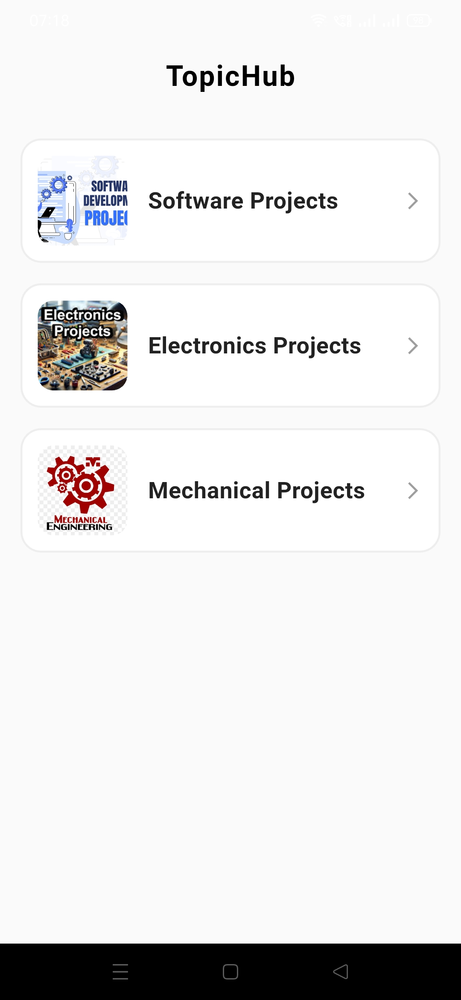
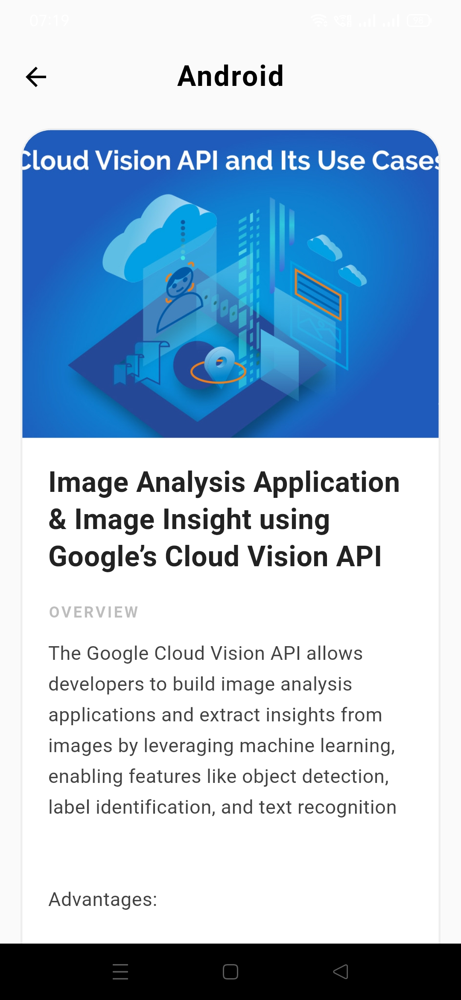
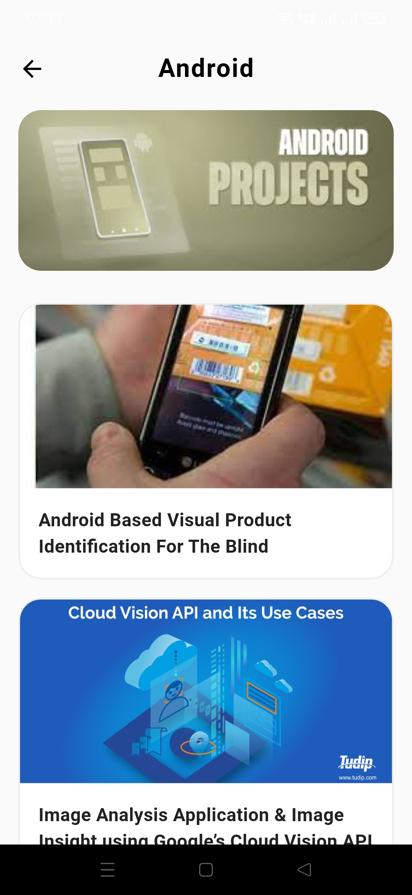
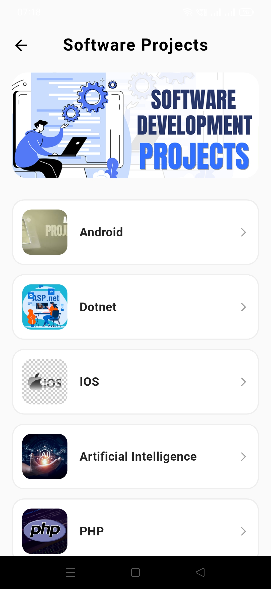

# TopicHub

A Flutter application for exploring categorized technical topics and projects through a REST API.

TopicHub was built as a practical project to learn and apply **Clean Architecture, REST API integration, GetX, Dio, dependency injection, and custom exception handling** in a Flutter application.

### Screenshots










## 📱 Overview

TopicHub organizes technical learning content into categories and provides users with a structured way to browse topics and related project information.

The project focuses on separating presentation logic, business logic, and data-access responsibilities while integrating data from a REST API.

## ✨ Features

* Browse categorized technical topics
* Navigate between categories, subcategories, and project details
* Fetch data from REST APIs using Dio
* Parse API responses into Dart models
* Reactive state management using GetX
* Dependency injection using GetX Bindings
* Application navigation using GetX routing
* Loading and error state handling
* Custom exception handling for API/data-layer errors
* Feature-first project organization
* Clean Architecture based separation of responsibilities

## 🛠️ Tech Stack

| Technology         | Purpose                                                     |
| ------------------ | ----------------------------------------------------------- |
| Flutter            | Application development                                     |
| Dart               | Programming language                                        |
| GetX               | State management, dependency injection, and navigation      |
| Dio                | HTTP client and REST API communication                      |
| REST API           | Remote data source                                          |
| Clean Architecture | Separation of presentation, business logic, and data layers |
| Git & GitHub       | Version control                                             |

## 🏗️ Architecture

The application follows Clean Architecture principles with a layered data flow:

```text
Presentation
     ↓
GetX Controller
     ↓
Use Case
     ↓
Repository
     ↓
Remote Data Source
     ↓
Dio
     ↓
REST API
```

The response then travels back through the layers:

```text
REST API
     ↓
Dio
     ↓
Remote Data Source
     ↓
Repository
     ↓
Use Case
     ↓
Controller
     ↓
UI
```

This separation keeps API communication and business logic independent from the UI layer.

## 📂 Project Structure

```text
lib/
├── core/
│   ├── bindings/
│   ├── network/
│   └── routes/
│
├── features/
│   └── ...
│
└── main.dart
```

The project is organized using a feature-first approach, with shared application concerns such as networking, bindings, and routing maintained inside the core layer.

## 🌐 REST API Integration

Dio is used as the HTTP client for communicating with the REST API.

The networking layer contains centralized API configuration and endpoint definitions, while the remote data source is responsible for making API requests.

The resulting data is converted into Dart models before being consumed by the upper layers.

### Data Flow

```text
UI
 ↓
Controller
 ↓
Use Case
 ↓
Repository
 ↓
Remote Data Source
 ↓
Dio Client
 ↓
REST API
 ↓
JSON Response
 ↓
Model
 ↓
Repository
 ↓
Use Case
 ↓
Controller
 ↓
UI
```

## ⚠️ Error Handling

The project includes custom exception handling to avoid exposing raw networking/API errors directly to the presentation layer.

Errors are handled within the data/networking flow and communicated back to the presentation layer so that the UI can respond appropriately.

This was an important part of the project because it helped me understand how failures should be propagated across architectural layers instead of handling every API error directly inside the UI.

## 🔄 State Management

GetX is used for reactive state management.

Controllers manage screen-related state and coordinate interactions between the presentation layer and the underlying use cases.

Reactive values are observed by the UI so that relevant parts of the interface can rebuild when state changes.

GetX is also used for:

* Dependency injection
* Route management
* Route arguments
* Controller lifecycle management
* Bindings

## 📸 Screenshots

### Splash Screen

<!-- Add screenshot here -->

### Categories / Topics

<!-- Add screenshot here -->

### Topic Listing

<!-- Add screenshot here -->

### Project Details

<!-- Add screenshot here -->

## 🎯 What I Learned

I built TopicHub as a practical project while learning professional Flutter development.

The main concepts I practiced were:

* Structuring a Flutter application using Clean Architecture
* Separating UI, business logic, and data-access responsibilities
* Integrating REST APIs using Dio
* Designing repository abstractions
* Working with remote data sources
* Parsing JSON responses into Dart models
* Managing application state using GetX
* Using dependency injection and Bindings
* Implementing GetX navigation and route arguments
* Designing custom exception handling
* Organizing a Flutter project using a feature-first structure
* Using Git and GitHub throughout development

## 🚀 Getting Started

### Prerequisites

Make sure Flutter is installed and configured on your system.

### Installation

Clone the repository:

```bash
git clone https://github.com/atharva-solves/topic-hub.git
```

Navigate to the project:

```bash
cd topic-hub
```

Install dependencies:

```bash
flutter pub get
```

Run the application:

```bash
flutter run
```

## 📌 Project Status

TopicHub is a portfolio and learning project that is being refined as I continue improving my Flutter development skills.

Future improvements may include additional UI refinement, improved responsiveness, testing, and further architectural improvements.

## 👨‍💻 Author

**Atharva Shinde**

GitHub: [atharva-solves](https://github.com/atharva-solves)

---

Built with Flutter and Dart.
